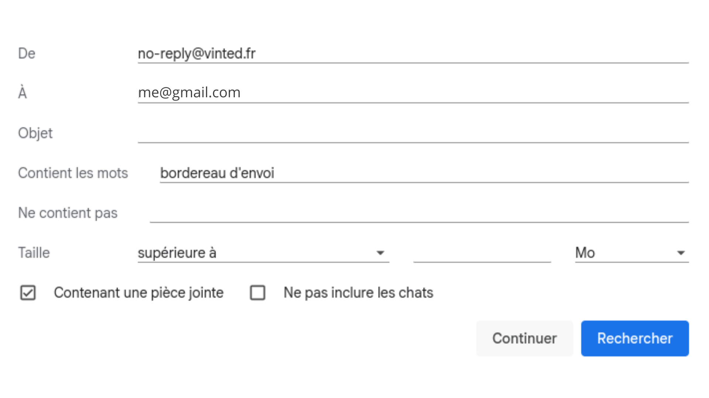

# Installation on Windows

## Step 0: Google Cloud Console Setup (Gmail API)

Before starting, you need to create a Google Cloud project and obtain credentials to access Gmail.

### 1. Create a Google Cloud Project

1. Go to https://console.cloud.google.com/
2. Click on **Select a project** → **New project**
3. Give the project a name (e.g., "Vinted Printer")
4. Click **Create**

### 2. Enable Gmail API

1. In the left menu: **APIs & Services** → **Library**
2. Search for **"Gmail API"**
3. Click on **Gmail API**
4. Click **Enable**

### 3. Create OAuth 2.0 Credentials

1. In the left menu: **APIs & Services** → **Credentials**
2. Click **+ Create Credentials** → **OAuth client ID**
3. If prompted, configure the OAuth consent screen:
   - Application type: **External**
   - Application name: "Vinted Printer"
   - User support email: your email
   - Click **Save and Continue**
   - Test users: add your Gmail address
   - Click **Save and Continue**
4. Go back to **Credentials** → **+ Create Credentials** → **OAuth client ID**
5. Application type: **Desktop app**
6. Name: "Vinted Printer key"
7. Click **Create**
8. **Download the JSON** and rename it to `credentials.json`
9. **Authorized redirect URIs** - Click **+ Add URI**
   * Enter: `http://localhost:8080/`
10. Place the `credentials.json` file in the project folder

### 4. Add Your Gmail Account as Test User

1. In **APIs & Services** → **OAuth consent screen**
2. **Audience** tab
3. **Test users** section → **+ Add Users**
4. Add your Gmail address
5. Click **Save**

**Note:** Your application will remain in "Test" mode, which is sufficient for personal use. You can use it with your Gmail account without limitations.

## Step 1: Install Python

1. Download **Python 3.12** (not 3.13) from https://www.python.org/downloads/
   - Or use this direct link: https://www.python.org/downloads/release/python-3120/
2. **⚠️ Important: Check "Add Python to PATH"** during installation
3. Install Python

**Note:** Python 3.13 is not yet supported by all libraries. Use Python 3.12.

## Step 2: Install Dependencies

1. Open a terminal (PowerShell or CMD) in the project folder
2. Install dependencies:
   ```
   pip install -r requirements.txt
   ```

## Step 3: Install SumatraPDF (for automatic printing)

1. Download **SumatraPDF**: https://www.sumatrapdfreader.org/download-free-pdf-viewer
2. Install SumatraPDF (free and lightweight)

**Note:** SumatraPDF is the best tool for automatic PDF printing. If you don't install it, the program will try to use Adobe Reader or Windows' default method (less reliable).

## Step 4: Configuration

1. Create a label in Gmail by going to Settings, See all settings, Labels, New Label, then filling it in like this for example

   

2. Create/edit the `.env` file in the project folder:

   ```
   GMAIL_LABEL=Your_Label         # Vinted shipping labels label name
   CHECK_INTERVAL=90              # scan interval in minutes
   PRINTER_NAME=Your_Printer      # printer name
   WORK_START_HOUR=8              # scan start time
   WORK_END_HOUR=22               # scan end time
   LOG_LEVEL=INFO                 # log level
   ```

3. Make sure the `credentials.json` file is present (Google API file)

## Step 5: Run the Program

Start PowerShell as administrator, navigate to the project folder and run:

```
python main.py
```

**Note:** The first time, it will ask you to log in to Google via your browser to authorize Gmail access.

You can leave the window open and the program running. You can configure your laptop to work even when closed by running PowerShell in administrator mode and pasting these commands:

```powershell
# 1. Do nothing when lid is closed (on AC power)
powercfg /setacvalueindex SCHEME_CURRENT 4f971e89-eebd-4455-a8de-9e59040e7347 5ca83367-6e45-459f-a27b-476b1d01c936 0

# 2. Do nothing when lid is closed (on battery)
powercfg /setdcvalueindex SCHEME_CURRENT 4f971e89-eebd-4455-a8de-9e59040e7347 5ca83367-6e45-459f-a27b-476b1d01c936 0

# 3. Disable automatic sleep (on AC power)
powercfg /change standby-timeout-ac 0

# 4. Disable automatic sleep (on battery)
powercfg /change standby-timeout-dc 0

# 5. Disable screen sleep (on AC power)
powercfg /change monitor-timeout-ac 0

# 6. Disable screen sleep (on battery)
powercfg /change monitor-timeout-dc 0

# 7. Disable hibernation
powercfg /hibernate off

# 8. Apply changes
powercfg /setactive SCHEME_CURRENT
```

Once these commands are validated, you can close your laptop connected to the printer and plugged into AC power, and the program will automatically print your shipping labels during the day!
